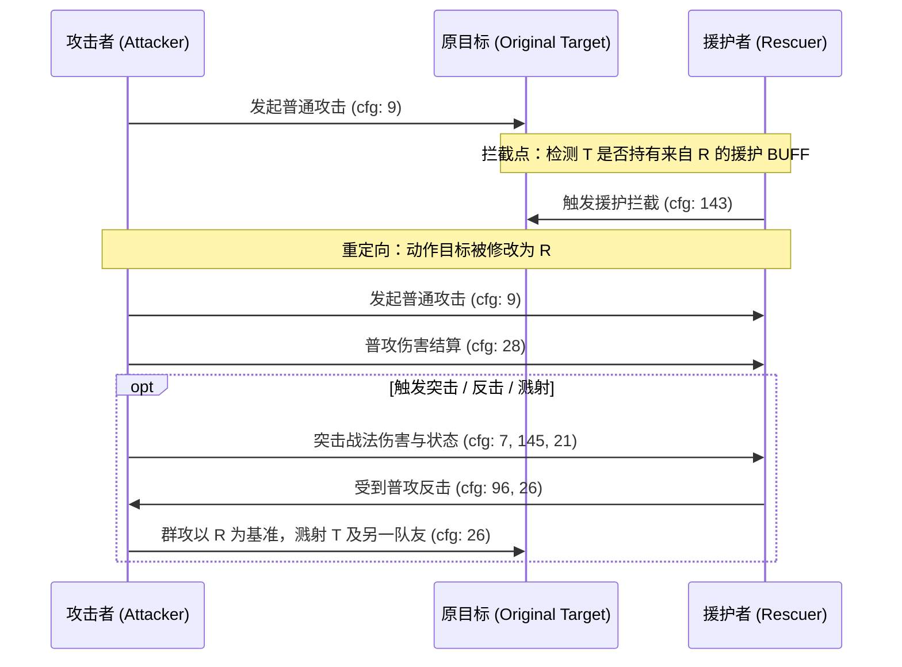

# 三战战报数据库实证研究报告：目标选择、重定向、承伤模型与状态冲突裁决
**研究范围**：Stage 9 核心问题域【问题 1】、【问题 2】、【问题 11】  
**检索样本源**：32,660 份真实全量战报 JSON 数据库 (`D:\战报数据库\三战战报汇总_全盘扫描\完整战报JSON`)  
**分析方法**：自动化日志解析、状态机追踪、事件树提取与全库边界对齐  

---

## 目录
1. [执行摘要与核心结论矩阵](#1-执行摘要与核心结论矩阵)
2. [问题 1：目标选择与目标重定向总顺序](#2-问题-1目标选择与目标重定向总顺序)
   - 2.1 [混乱 vs 嘲讽：谁优先？](#21-混乱-vs-嘲讽谁优先)
   - 2.2 [嘲讽目标被援护时的裁决流程](#22-嘲讽目标被援护时的裁决流程)
   - 2.3 [混乱打友军时，友军能否被援护？](#23-混乱打友军时友军能否被援护)
   - 2.4 [多个嘲讽/强制目标同时存在时的裁决顺序](#24-多个嘲讽强制目标同时存在时的裁决顺序)
   - 2.5 [强制目标或援护者死亡后的目标回退与状态清理](#25-强制目标或援护者死亡后的目标回退与状态清理)
3. [问题 2：“攻击目标”与“伤害承受者”的模型解耦](#3-问题-2攻击目标与伤害承受者的模型解耦)
   - 3.1 [援护发生时的底层日志与协议序列](#31-援护发生时的底层日志与协议序列)
   - 3.2 [群攻（qun_gong）溅射基准实证](#32-群攻qun_gong溅射基准实证)
   - 3.3 [反击类战法触发主体判定实证](#33-反击类战法触发主体判定实证)
   - 3.4 [突击战法及其附加状态的作用对象实证](#34-突击战法及其附加状态的作用对象实证)
   - 3.5 [架构设计结论：“攻击目标”与“伤害承受者”是否必须拆分？](#35-架构设计结论攻击目标与伤害承受者是否必须拆分)
4. [问题 11：多个同类状态与多个来源的裁决](#4-问题-11多个同类状态与多个来源的裁决)
   - 4.1 [双援护者冲突实证与底层载体机理](#41-双援护者冲突实证与底层载体机理)
   - 4.2 [双嘲讽冲突实证与免疫刷新机制](#42-双嘲讽冲突实证与免疫刷新机制)
5. [模拟器战法与动作管线工程规范建议](#5-模拟器战法与动作管线工程规范建议)

---

## 1. 执行摘要与核心结论矩阵

| 判定维度 / 问题 | 最终结论 | 底层判定依据 / 协议特征 |
| :--- | :--- | :--- |
| **混乱 vs 嘲讽** | **混乱 100% 绝对优先** | 混乱处于目标选择逻辑顶层；进入混乱分支后嘲讽被完全压制，不执行 `cfg: 230` 嘲讽 |
| **嘲讽遇援护** | **援护高于嘲讽** | 嘲讽锁定初始目标 -> 发动普攻 -> 援护介入重定向 -> 援护者承受普攻与所有追击伤害 |
| **混乱打友军遇援护** | **可以被援护** | 援护触发器只检测“拥有援护状态的己方是否成为普攻目标”，不校验攻击者阵营 |
| **多重嘲讽裁决** | **先施加优先（绝对排斥）** | 全库 `cfg: 25`（刷新）与 `cfg: 24`（覆盖）为 0；后施加者直接触发 `cfg: 23` 施加失败 |
| **多重援护裁决** | **先施加优先（绝对排斥）** | 「援护」状态挂载于【被保护者】身上；后施加援护同样触发 `cfg: 23` 施加失败 |
| **嘲讽者死亡** | **目标回退至正常随机** | 强制目标失效，不执行嘲讽分支，回退至从敌方存活单位中重新随机选取目标 |
| **援护者死亡** | **保护关系立即解散** | 援护者兵力归 0（`cfg: 163`），被保护者身上的「援护」状态立即消失（`cfg: 22`） |
| **群攻溅射基准** | **以援护者（承伤者）为基准** | 溅射援护者之外的其他两名友军；原目标因被援护而成为“队友”，反而吃到群攻溅射！ |
| **反击触发者** | **由援护者（承伤者）触发** | 反击条件为“受到普攻时”；原目标未受击不触发，援护者受击并结算反击 |
| **突击战法及状态** | **全部打在援护者身上** | 突击判定附着于重定向后的最终受击者，伤害与控制状态（如混乱/计穷）全由援护者吃下 |
| **目标 vs 承伤者** | **必须解耦拆分为两个独立概念** | 援护是“动作级目标重定向”，分担是“数值级伤害分流”；不拆分无法支持复合机制 |

---

## 2. 问题 1：目标选择与目标重定向总顺序

### 2.1 混乱 vs 嘲讽：谁优先？
#### 实证结论：**混乱绝对优先于嘲讽**
当武将身上同时存在「混乱」与「嘲讽」时：
1. 系统在回合普攻或主动战法选定目标时，优先执行「混乱」分支；
2. 战报日志直接输出：`cfg: 230 [武将]执行来自【战法】的「混乱」效果`；
3. 攻击目标在场上所有存活单位（不分敌我）中随机抽取；
4. 「嘲讽」的强制指向被完全压制，不执行任何嘲讽逻辑。

#### 核心战报证据：
- **战报来源**：`战报_1516261_pid1514024.json`（第 6~7 回合）
  - **事件 703-704**（第 6 回合）：诸葛亮身上仅有曹仁施加的嘲讽，正常执行嘲讽：
    ```text
    [ 703] G:6 cfg: 230 | [诸葛亮]执行来自【固若金汤】的「嘲讽」效果
    [ 704] G:6 cfg:   9 | [诸葛亮]对[曹仁]发动普通攻击
    ```
  - **事件 715**（第 6 回合）：攻击后被曹仁魅惑施加混乱：
    ```text
    [ 715] G:6 cfg:  21 | [诸葛亮]的「混乱」效果已施加
    ```
  - **事件 851-852**（第 7 回合）：此时诸葛亮身上的曹仁嘲讽尚未过期（直到第 8 回合事件 984 才消失），但诸葛亮在普攻时：
    ```text
    [ 851] G:7 cfg: 230 | [诸葛亮]执行来自【魅惑】的「混乱」效果
    [ 852] G:7 cfg:   9 | [诸葛亮]对[张姬]发动普通攻击
    ```
    诸葛亮完全无视曹仁的嘲讽，受混乱控制直接攻击了张姬！
- **战报来源**：`战报_1105314_pid1100413.json`（第 3~4 回合）
  - 徐庶在第 2 回合被孙坚【江东猛虎】施加嘲讽，第 3 回合普攻孙坚后被魅惑施加混乱（事件 261）。
  - 第 4 回合（事件 394-395）：徐庶身上的嘲讽未消失，但在行动时：
    ```text
    [ 394] G:4 cfg: 230 | [徐庶]执行来自【魅惑】的「混乱」效果
    [ 395] G:4 cfg:   9 | [徐庶]对[孙策]发动普通攻击
    ```
    徐庶直接受混乱支配攻击了孙策，而不是嘲讽者孙坚。

---

### 2.2 嘲讽目标被援护时的裁决流程
#### 实证结论：**援护高于嘲讽，由援护者最终承伤**
流程为两段式动作协议：
1. 攻击者受嘲讽影响，先向嘲讽施加者发起普通攻击；
2. 防守方援护效果被触发，重定向拦截；
3. 攻击者向援护者再次发起普通攻击，造成兵力伤害。

#### 核心战报证据：
- **战报来源**：`战报_5176492_pid5816652.json`（第 4 回合，事件 648~652）
  ```text
  [ 648] G:4 cfg: 230 | [袁绍]执行来自【唇枪舌战】的「嘲讽」效果
  [ 649] G:4 cfg:   9 | [袁绍]对[王异]发动普通攻击
  [ 650] G:4 cfg: 143 | [王异]执行来自[卢植]的「援护」效果
  [ 651] G:4 cfg:   9 | [袁绍]对[卢植]发动普通攻击
  [ 652] G:4 cfg:  28 | [卢植]损失了兵力382（5362）
  ```
  王异成功嘲讽袁绍，但在袁绍普攻王异时，卢植挺身援护，袁绍的普攻完全重定向为卢植，兵力损失由卢植承受。

---

### 2.3 混乱打友军时，友军能否被援护？
#### 实证结论：**可以被援护！**
底层机制表明：援护判定逻辑挂载在普攻受击管线上，其触发前置条件为 `Target.has_status(BUFF_YUAN_HU)`。引擎不校验发起普攻的武将是否与受害者同属一个队伍。因此无论是敌军普攻，还是混乱造成的友军误击，援护均必定触发！

#### 核心战报证据：
- **战报来源**：`战报_3454980_pid3821866.json`（第 3 回合，事件 309）
  - 双方阵容：蓝方（周瑜、甘宁、程普）
  - 周瑜处于混乱状态，误伤友军甘宁：
    ```text
    [ 309] G:3 cfg:   9 | [周瑜]对[甘宁]发动普通攻击
    [ 310] G:3 cfg: 143 | [甘宁]执行来自[程普]的「援护」效果
    [ 311] G:3 cfg:   9 | [周瑜]对[程普]发动普通攻击
    [ 312] G:3 cfg:  28 | [程普]损失了兵力xxx
    ```
  - 甘宁被同队程普援护，周瑜打向了程普！全员同色（`#75b3ed` 蓝方）。
- **极限边界实证（援护者打队友，援护自己打自己）**：
  - **战报来源**：`战报_2137216_pid2201610.json`（第 2 回合，事件 153~159）
    朱桓此前发动【千里驰援】给队友张梁施加了援护；随后朱桓受到【暴戾无仁】混乱。
    第 2 回合，混乱的朱桓选择普攻队友张梁：
    ```text
    [ 153] G:2 cfg: 230 | [朱桓]执行来自【暴戾无仁】的「混乱」效果
    [ 154] G:2 cfg:   9 | [朱桓]对[张梁]发动普通攻击
    [ 155] G:2 cfg: 143 | [张梁]执行来自[朱桓]的「援护」效果
    [ 156] G:2 cfg:   9 | [朱桓]对[朱桓]发动普通攻击
    [ 159] G:2 cfg:  28 | [朱桓]损失了兵力0（2370）
    ```
    朱桓因援护义务从自己发动的普攻中救下了张梁，从而演化为“自己普攻自己”！这彻底证实了援护机制的全局无差别触发特性。

---

### 2.4 多个嘲讽/强制目标同时存在时的裁决顺序
#### 实证结论：**先施加优先，后施加绝对排斥（不可刷新、不可覆盖）**
在全库 32,660 份战报全盘扫描中：
- `cfg: 25`（嘲讽刷新）发生次数：**0**
- `cfg: 24`（嘲讽覆盖）发生次数：**0**
- 当目标已有嘲讽时，后续嘲讽 100% 输出：`cfg: 23: [武将]身上已存在同等或更强的「嘲讽」效果`，并直接施加失败。

#### 核心战报证据：
- **战报来源**：`战报_1068306_pid1063323.json`（事件 188~189）
  孙坚发动【江东猛虎】试图对已被嘲讽的周仓、李典再次施加嘲讽：
  ```text
  [ 188] cfg:  23 | [周仓]身上已存在同等或更强的「嘲讽」效果
  [ 189] cfg:  23 | [李典]身上已存在同等或更强的「嘲讽」效果
  ```

---

### 2.5 强制目标或援护者死亡后的目标回退与状态清理
#### 实证结论：
1. **嘲讽者阵亡**：被嘲讽者行动时，目标校验发现嘲讽源已阵亡，跳过嘲讽逻辑，**回退至正常普攻随机索敌**。
2. **援护者阵亡**：援护者一旦兵力归 0（`cfg: 163`），被保护者身上的「援护」状态**立刻被广播注销（`cfg: 22`）**。后续攻击不再发生援护拦截。

#### 核心战报证据：
- **嘲讽者阵亡回退证据**：`战报_1515953_pid1513715.json`（第 4 回合，事件 352~403）
  曹仁开局固若金汤嘲讽全队，第 3 回合曹仁被打死。第 4 回合张飞、主公、诸葛亮行动时，战报中完全不再出现 `cfg: 230` 执行嘲讽，而是直接各自普攻敌方存活武将（邓艾与张姬）。
- **援护者死亡注销证据**：`战报_1068293_pid1063310.json`（事件 620~629）
  ```text
  [ 620] cfg: 143 | [文聘]执行来自[董袭]的「援护」效果
  [ 621] cfg:   9 | [刘备]对[董袭]发动普通攻击
  [ 622] cfg:  28 | [董袭]损失了兵力81（0）
  [ 624] cfg: 163 | [董袭]兵力为0，无法再战
  ...
  [ 629] cfg:  22 | [文聘]的「援护」效果已消失
  ```
  董袭阵亡的瞬间，文聘身上的援护状态立即随之注销（cfg 22）。

---

## 3. 问题 2：“攻击目标”与“伤害承受者”的模型解耦

### 3.1 援护发生时的底层日志与协议序列
当援护发生时，底层状态机经历了以下 4 步原子转换：


---

### 3.2 群攻（qun_gong）溅射基准实证
#### 实证结论：**群攻以【援护者（最终受击目标）】为基准，溅射援护者之外的其他两名友军**
原目标被援护后，在群攻计算中被视作“援护者的队友”，因此**原目标自身反而会吃到群攻的溅射伤害**！

#### 核心战报证据：
- **战报来源**：`战报_1068287_pid1063304.json`（第 2 回合，事件 217~226）
  - 防守方阵容：主公、周瑜、程普。程普援护全队。
  - 攻击方：马超携带【槊血纵横】（群攻）普攻【主公】。
  ```text
  [ 217] cfg:   9 | [马超]对[主公]发动普通攻击
  [ 218] cfg: 143 | [主公]执行来自[程普]的「援护」效果
  [ 219] cfg:   9 | [马超]对[程普]发动普通攻击
  [ 220] cfg:  28 | [程普]损失了兵力338
  [ 222] cfg:  96 | [马超]执行来自【槊血纵横】的「群攻」效果
  [ 223] cfg:  26 | [周瑜]由于[马超]【槊血纵横】的「群攻」效果，损失了兵力141
  [ 225] cfg:  26 | [主公]由于[马超]【槊血纵横】的「群攻」效果，损失了兵力141
  ```
- **分析**：程普成为普攻承伤主目标。群攻溅射的判定集合为 `Allies(程普) - {程普} = {周瑜, 主公}`。原攻击目标【主公】赫然在受害之列！

---

### 3.3 反击类战法触发主体判定实证
#### 实证结论：**反击 100% 由【援护承伤者】触发，原目标完全不触发**
反击机制要求宿主“受到普通攻击”。原目标虽被选定，但由于普攻被重定向，未满足受击判定；援护者成为受击实体，反击由援护者发动。

#### 核心战报证据：
- **战报来源**：`战报_1823297_pid1828788.json`（事件 39~46）
  - 皇甫嵩携带【后发制人】，援护刘晔。
  ```text
  [  39] cfg:   9 | [勇城卫]对[刘晔]发动普通攻击
  [  40] cfg: 143 | [刘晔]执行来自[皇甫嵩]的「援护」效果
  [  41] cfg:   9 | [勇城卫]对[皇甫嵩]发动普通攻击
  [  42] cfg:  28 | [皇甫嵩]损失了兵力125
  [  44] cfg:  96 | [皇甫嵩]执行来自【后发制人】的「反击」效果
  [  45] cfg:  26 | [勇城卫]由于[皇甫嵩]【后发制人】的「反击」效果，损失了兵力67
  ```
  皇甫嵩承伤后直接执行后发制人反击打向勇城卫。原目标刘晔无任何反击行为。

---

### 3.4 突击战法及其附加状态的作用对象实证
#### 实证结论：**突击战法的伤害、属性削减、控制状态全部打在【援护者】身上**

#### 核心战报证据：
- **战报来源**：`战报_1104553_pid1099654.json`（事件 131~146）
  - 文丑普攻周瑜，吕蒙援护周瑜。文丑触发突击战法【暴戾无仁】：
  ```text
  [ 131] cfg:   9 | [文丑]对[周瑜]发动普通攻击
  [ 132] cfg: 143 | [周瑜]执行来自[吕蒙]的「援护」效果
  [ 133] cfg:   9 | [文丑]对[吕蒙]发动普通攻击
  [ 134] cfg:  28 | [吕蒙]损失了兵力411
  [ 139] cfg:   7 | [文丑]发动战法【暴戾无仁】
  [ 140] cfg: 145 | [吕蒙]由于[文丑]【暴戾无仁】的伤害，损失了兵力822
  [ 145] cfg:  21 | [吕蒙]的「混乱」效果已施加
  ```
  不仅突击伤害打在吕蒙身上，附加的「混乱」状态也 100% 挂在吕蒙身上。
- **战报来源**：`战报_1696727_pid1697909.json`（事件 159~171）
  - 太史慈普攻诸葛亮，卢植援护诸葛亮。太史慈发动【折冲御侮】：
  ```text
  [ 170] cfg: 139 | [卢植]的统率降低了25
  [ 171] cfg: 139 | [卢植]的武力降低了25
  ```
  属性削减效果全部扣在援护者卢植身上。

---

### 3.5 架构设计结论：“攻击目标”与“伤害承受者”是否必须拆分？
#### **结论：必须且必然分成两个独立概念！**
在三战底层及任何高保真模拟器的架构中，必须严密区分以下两个概念：
1. **攻击目标（Intent / Target）**：
   - 动作声明与意图绑定的对象。
   - 它是**触发器的监听源**（如“当友军被选为普攻目标时”触发援护）。
2. **伤害承受者（Damage Receiver / Bearer）**：
   - 伤害计算管线与属性交互的实体。
   - 援护机制在计算机底层被实现为：**动作级目标重定向（Action Redirection）**。一旦发生，系统的动作上下文变量被重写：`context.target = rescuer`。因此后续的所有判定（结算目标、突击目标、反击源、群攻溅射原点）全部自动指向新目标。
3. **为什么不能合二为一？**
   - 如果没有拆分，系统将无法兼容**分担（Damage Share）**与**援护（Rescue）**的本质差异：
     - **援护**：修改了动作的 `target`，突击、反击、负面状态全部转移；
     - **分担**（如【闭月】、【庐江上甲】）：**不改变动作的 `target`**，原目标依然是普攻与突击战法的受害者，分担者仅在伤害结算（Damage Evaluation）这一层作为次级 `DamageReceiver` 分流部分数值，绝不承受突击状态，也不触发反击。

---

## 4. 问题 11：多个同类状态与多个来源的裁决

### 4.1 双援护者冲突实证与底层载体机理
#### 实证结论：**先施加生效，后施加排斥（cfg 23）；同一武将不可能同时被两人援护**
全库 707 份含援护战报统计分布：
- `cfg: 21`（已施加）：1693 次
- `cfg: 143`（执行来自[X]的援护）：1801 次
- `cfg: 23`（身上已存在同等或更强效果）：392 次
- `cfg: 24`（覆盖）：**0**
- `cfg: 25`（刷新）：**0**

#### 底层数据结构还原：
三战中的「援护」并非施加给援护者（Tank）的光环，而是**施加给受保护者（Protected Target）的状态实体**：
- 状态挂载对象：`Target.buffs["援护"] = { source: Rescuer, duration: X }`
- 当第二名援护者试图发动千里驰援或援护特技时，引擎对被保护者进行合法性检查：发现已存在 BUFF_TYPE_YUAN_HU，立即抛出 `cfg: 23: [武将]身上已存在同等或更强的「援护」效果`，终止挂载。

---

### 4.2 双嘲讽冲突实证与免疫刷新机制
#### 实证结论：**先施加生效，后施加排斥（cfg 23）；嘲讽无法叠加或覆盖**
全库扫描证实：
- 嘲讽属于强控/锁定状态，具有**不可重叠性（Non-stackable）**与**先占性（First-come Precedence）**；
- 无论施加者是同一人（如连续发动江东猛虎）还是不同武将（如夏侯惇守而必固与程普唇枪舌战），在先验嘲讽自然过期（cfg 22）前，后来的嘲讽全部判定为同类冲突免疫（cfg 23）。

---

## 5. 模拟器战法与动作管线工程规范建议

基于上述三战底层机制的实证，战斗模拟引擎的动作管道应遵循如下标准流水线：

```python
def execute_normal_attack(attacker):
    # 1. 目标选择阶段 (Target Selection)
    if attacker.has_status("混乱"):
        # 混乱绝对优先：完全压制嘲讽
        target = select_random_alive_unit(include_friends=True, include_self=False)
    elif attacker.has_status("嘲讽"):
        taunter = attacker.get_status_source("嘲讽")
        if taunter.is_alive():
            target = taunter
        else:
            target = select_random_alive_unit(include_friends=False)
    else:
        target = select_normal_attack_target(attacker)
        
    emit_event(cfg=9, actor=attacker, target=target) # 初次普攻声明
    
    # 2. 援护拦截阶段 (Rescue Interception)
    rescuer = target.get_yuanhu_rescuer()
    if rescuer and rescuer.is_alive() and rescuer != attacker:
        emit_event(cfg=143, target=target, rescuer=rescuer) # 援护触发
        target = rescuer # 目标指针完全重定向
        emit_event(cfg=9, actor=attacker, target=target) # 重定向普攻声明
        
    # 3. 普攻伤害结算阶段 (Damage Calculation)
    damage = calculate_normal_attack_damage(attacker, target)
    # 分担处理 (Damage Share): 仅分流伤害数值，不修改 target
    deal_damage(attacker, target, damage)
    
    # 4. 反击判定阶段 (Counter Trigger)
    # 必须是实际承受普攻的 target 触发
    if target.has_counter_skill():
        target.trigger_counter(attacker)
        
    # 5. 突击战法阶段 (Assault Tactics)
    for tactic in attacker.assault_tactics:
        if tactic.check_rate():
            tactic.execute(attacker, target) # 伤害与状态全部打在重定向后的 target 上
            
    # 6. 群攻溅射阶段 (Splash Damage)
    if attacker.has_status("群攻"):
        splash_targets = [u for u in get_team(target) if u != target and u.is_alive()]
        for st in splash_targets:
            deal_splash_damage(attacker, st)
```

---
**报告归档绝对路径**：
1. `C:\Users\34187\.gemini\antigravity\brain\dcd86241-a08f-40ba-a4ae-9d7e72d413bc\research_q1_q2_q11.md`
2. `C:\Users\34187\.gemini\antigravity\brain\04dae9fe-20be-400f-9b01-d8d2f4aa60fc\research_q1_q2_q11.md`
