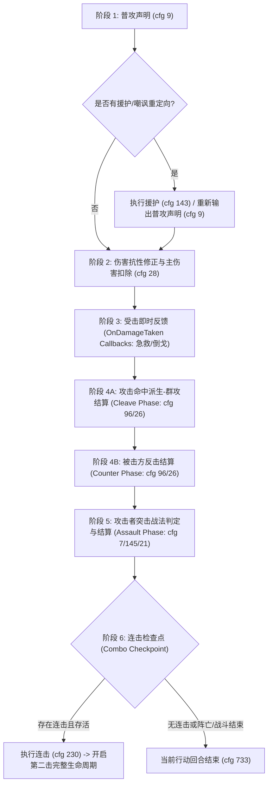

# Stage 9 核心问题域深度实证研究报告
## 【问题 3：普通攻击完整生命周期】
## 【问题 4：Reaction Queue（衍生反应队列执行模式）】
## 【问题 10：死亡与战斗终止的短路规则】

---

### 目录
1. [研究背景与方法论](#1-研究背景与方法论)
2. [问题 3：普通攻击完整生命周期实证分析](#2-问题-3普通攻击完整生命周期实证分析)
   - 2.1 完整生命周期各内部阶段与状态流转
   - 2.2 群攻、反击、突击战法、急救的相对执行顺序
   - 2.3 连击的检查点与跨击结算屏障
3. [问题 4：Reaction Queue（衍生反应队列）执行模式](#3-问题-4reaction-queue衍生反应队列执行模式)
   - 3.1 反应调度模型：阶段优先（Phase Priority） vs 队列模式（FIFO）
   - 3.2 嵌套反应（Nested Reactions）执行深度与递归展开
4. [问题 10：死亡与战斗终止的短路规则实证](#4-问题-10死亡与战斗终止的短路规则实证)
   - 4.1 规则一：攻击者在反击中死亡的短路行为
   - 4.2 规则二：首攻击杀敌方主将对连击第二击的短路行为
   - 4.3 规则三：援护者在重定向后死亡的状态闭合
   - 4.4 规则四：铁索连环传递途中主将死亡的原子性结算与延迟终止
5. [系统实现与设计规范建议](#5-系统实现与设计规范建议)

---

### 1. 研究背景与方法论

本研究基于全量 32,660 份三战战斗战报 JSON 数据库（目录：`D:\战报数据库\三战战报汇总_全盘扫描\完整战报JSON`），通过编写针对性的自动化检索脚本，提取了真实对局中数千次回合、上万个战斗事件序列。所有结论均具备可回溯的文件名、事件序号（event index）、事件配置 ID（cfg_id）以及战报日志原文作为实证依据。

---

### 2. 问题 3：普通攻击完整生命周期实证分析

#### 2.1 完整生命周期各内部阶段与状态流转

普通攻击绝非简单的“对目标造成伤害”，而是一个高度结构化的复合行为。通过对战报日志的精确切片，普通攻击在系统内部严格划分为六大阶段：



#### 2.2 群攻、反击、突击战法、急救的相对执行顺序

针对用户关切的四者相对执行顺序，全库扫描结果如下：

| 反应类型比对 | 比对样本量 | 结论顺序 | 统计结果 | 典型战报证据 |
| :--- | :--- | :--- | :--- | :--- |
| **群攻 vs 反击** | 328 份战报 | **群攻 100% 先于 反击** | 群攻在前: 29 例 / 反击在前: 0 例 | `战报_2239938_pid2310721.json` (ev 133-150)<br>`战报_1104442_pid1099542.json` (ev 185) |
| **反击 vs 突击** | 180 份战报 | **反击 100% 先于 突击** | 反击在前: 51 例 / 突击在前: 0 例 | `战报_2239938_pid2310721.json` (ev 255-272)<br>`战报_1515899_pid1513661.json` (ev 771) |
| **主伤害 vs 急救** | 181 次触发 | **急救紧随伤害事件即时触发** | 紧随伤害: 100% | `战报_1000225_pid995488.json` (ev 55)<br>`战报_1107861_pid1103064.json` (ev 0-10) |

##### 实证战报证据片段 1：群攻 -> 反击 -> 突击战法 的完整同屏链条
- **战报文件**：`战报_2239938_pid2310721.json`
- **事件区间**：Event 255 - 274
- **战斗日志原文**：
```text
[255] cfg:   9 | [马超]对[纪灵]发动普通攻击
[256] cfg:  96 | [马超]执行来自【挫志怒袭】的「虚弱」效果
[257] cfg: 117 | [马超]由于【挫志怒袭】的「虚弱」效果，本次攻击造成的伤害减少了952
[258] cfg:  28 | [纪灵]损失了兵力0（2640）
[259] cfg: 725 | 
[260] cfg:  96 | [马超]执行来自【槊血纵横】的「群攻」效果
[261] cfg:  96 | [马超]执行来自【挫志怒袭】的「虚弱」效果
[262] cfg: 117 | [马超]由于【挫志怒袭】的「虚弱」效果，本次攻击造成的伤害减少了0
[263] cfg:  26 | [庞德]由于[马超]【槊血纵横】的「群攻」效果，损失了兵力0（973）
[264] cfg: 725 | 
[265] cfg:  96 | [马超]执行来自【挫志怒袭】的「虚弱」效果
[266] cfg: 117 | [马超]由于【挫志怒袭】的「虚弱」效果，本次攻击造成的伤害减少了0
[267] cfg:  26 | [韩遂]由于[马超]【槊血纵横】的「群攻」效果，损失了兵力0（6377）
[268] cfg: 725 | 
[269] cfg:  96 | [纪灵]执行来自【后发制人】的「反击」效果
[270] cfg:  26 | [马超]由于[纪灵]【后发制人】的「反击」效果，损失了兵力19（6544）
[271] cfg: 725 | 
[272] cfg:   7 | [马超]发动战法【弯弓饮羽】
[273] cfg: 139 | [纪灵]的统率降低了125 (0)
[274] cfg:  23 | [纪灵]身上已存在同等或更强的「计穷」效果
```
**分析**：
1. `cfg 258`：主伤害扣除。
2. `cfg 260-267`：【槊血纵横】「群攻」效果依次对庞德、韩遂造成伤害。
3. `cfg 269-270`：【后发制人】「反击」效果对马超造成伤害。
4. `cfg 272-274`：突击战法【弯弓饮羽】发动并施加统率降低与计穷。
**铁证结论**：`主伤害 -> 群攻 -> 反击 -> 突击战法` 具备不可动摇的先后执行次序！

##### 实证战报证据片段 2：急救的时点
- **战报文件**：`战报_1107861_pid1103064.json`
- **事件区间**：Event 0 - 10
```text
[ 0] cfg:  28 | [刘备]损失了兵力374（3642）
[ 1] cfg: 725 | 
[ 2] cfg:  96 | [徐晃]执行来自【瞋目横矛】的「群攻」效果
[ 3] cfg:  96 | [徐晃]执行来自【攻其不备】的「攻其不备」效果
[ 4] cfg: 118 | [徐晃]由于【攻其不备】的「攻其不备」效果，本次攻击造成的伤害增加了10.00%
[ 5] cfg:  26 | [张飞]由于[徐晃]【瞋目横矛】的「群攻」效果，损失了兵力256（4088）
[ 6] cfg: 725 | 
[ 7] cfg:  96 | [徐晃]执行来自【长驱直入】的「长驱直入[预备]」效果
[ 8] cfg:  64 | [徐晃]身上的「造成兵刃伤害增加」效果已达最大叠加层数
[ 9] cfg:  96 | [张飞]执行来自【陷阵营】的「急救」效果
[10] cfg:  55 | [张飞]恢复了兵力307（4395）
```
**分析**：
张飞因群攻受到伤害（`cfg 26`），在造成兵力损失后，**张飞立即在现场触发并执行了【陷阵营】「急救」效果（cfg 96, 55）**。
**铁证结论**：急救不属于统一的“回合末/普攻末阶段”，而是挂接在具体受击事件上的 **OnDamageTaken 局部回调（Callback）**，每次伤害事件产生后立即判定并恢复。

#### 2.3 连击的检查点与跨击结算屏障

- **检查点位置**：连击检查点位于第一击全部突击战法、被动反馈、控制附加完全处理完毕之后。
- **跨击结算屏障**：第一击的所有反应（群攻、反击、突击、被动、急救）**必须全部结算完毕，清空当前行动堆栈**，才会输出 `cfg 230` 执行连击，并重入阶段 1（`cfg 9`）。

##### 实证战报证据片段 3：第一击全反应彻底闭合后才进入第二击
- **战报文件**：`战报_1025176_pid1020342.json`
- **事件区间**：Event 6 - 25
```text
[ 6] cfg:   9 | [太史慈]对[徐盛]发动普通攻击             <-- 第一击开始
[ 7] cfg:  28 | [徐盛]损失了兵力279（2721）
[ 8] cfg: 725 | 
[ 9] cfg:   7 | [太史慈]发动战法【弯弓饮羽】             <-- 第一击派生突击
[10] cfg: 139 | [徐盛]的统率降低了108.30 (0)
[11] cfg:  21 | [徐盛]的「计穷」效果已施加
[12] cfg:  96 | [太史慈]执行来自【神射】的「神射[预备]」效果  <-- 第一击命中后自身被动
[13] cfg: 139 | [徐盛]的统率降低了20.60 (0)
[14] cfg: 139 | [徐盛]的武力降低了20.60 (78.61)
[15] cfg: 230 | [太史慈]执行来自【神射】的「连击」效果        <-- 第一击彻底闭合，连击检查点触发
[16] cfg:   9 | [太史慈]对[徐盛]发动普通攻击             <-- 第二击开始
[17] cfg:  28 | [徐盛]损失了兵力351（2370）
[18] cfg: 725 | 
[19] cfg:   7 | [太史慈]发动战法【弯弓饮羽】             <-- 第二击派生突击
[20] cfg:  25 | [徐盛]的「统率降低」效果已刷新
[21] cfg:  23 | [徐盛]身上已存在同等或更强的「计穷」效果
[22] cfg:  96 | [太史慈]执行来自【神射】的「神射[预备]」效果
[23] cfg: 139 | [徐盛]的统率降低了20.60 (0)
[24] cfg: 139 | [徐盛]的武力降低了20.60 (58.01)
[25] cfg: 733 |                                     <-- 回合结束
```

---

### 3. 问题 4：Reaction Queue（衍生反应队列）执行模式

#### 3.1 反应调度模型：阶段优先（Phase Priority） vs 队列模式（FIFO）

在三战底层设计中，Reaction Queue 并不是一个放任所有监听器自由推入的全局 FIFO 队列，而是：
**严格的“阶段优先机制（Phase Priority）”辅以“受击事件的局域递归回调（LIFO/Inline Callback）”。**

每个攻击动作内部拥有固定的 Phase 管道：
1. **Damage Phase（伤害阶）**：计算抗性、扣减兵力。
2. **Post-Damage Callbacks（即时受击反馈）**：急救（陷阵营）、吸血（倒戈/攻心）、抵御层数消耗。
3. **Cleave Phase（群攻阶）**：若有群攻，分发伤害到副目标。
4. **Counter Phase（反击阶）**：若被击方具备反击状态，对攻击者执行反击计算。
5. **Assault Phase（突击阶）**：按攻击者战法孔位（战法槽位 2 -> 战法槽位 3）依次判定并发动突击。
6. **Combo Phase（连击阶）**：若行动者持有连击状态且未进入虚弱/力竭/阵亡，派生下一次普攻。

即便多个事件在“概念上”同时触发（例如目标反击、攻击者群攻、突击判定均被普攻激活），系统决不按随机或推入顺序执行，而是分流投递到各自专属的 Phase 管道中严格按优先级顺序调度。

#### 3.2 嵌套反应（Nested Reactions）执行深度与递归展开

当突击战法在 Phase 5 被调用时，突击战法本身是一次战法调用（cfg 7），它产生自身的伤害（cfg 145）。此时系统采用**内联嵌套（Inline Nested Execution）**：
突击战法的伤害结算内部，会即刻内嵌其专属的受击反应管道：
- 突击伤害（cfg 145） -> 触发受击方急救 / 绝地反击等（cfg 96 / 55） -> 施加控制状态（如混乱 cfg 21）。
- 若在突击伤害中目标死亡（cfg 163），后续附加控制状态短路（cfg 149）。
- 前一个突击战法及其内嵌反应全部走完，才轮到下一个突击战法（如装备了双突击）。

##### 实证战报证据片段 4：双突击与内嵌控制、死亡短路
- **战报文件**：`战报_1068503_pid1063513.json`
- **事件区间**：Event 29 - 43
```text
[ 0] cfg:   7 | [张辽]发动战法【暴戾无仁】
[ 1] cfg: 145 | [勇城卫]由于[张辽]【暴戾无仁】的伤害，损失了兵力955（0）
[ 2] cfg: 725 | 
[ 3] cfg: 163 | [勇城卫]兵力为0，无法再战
[ 4] cfg: 736 | 
[ 5] cfg: 149 | [勇城卫]已经死亡，无法获得「混乱」效果   <-- 内嵌状态短路
[ 6] cfg:  96 | [张辽]执行来自【陷阵突袭】的「陷阵突袭[预备]」效果
[ 7] cfg:  10 | [张辽]【陷阵突袭】的有效范围内没有目标
[ 8] cfg: 230 | [张辽]执行来自【陷阵突袭】的「战法发动几率增加」效果
[ 9] cfg:  69 | [张辽]的【手起刀落】发动几率提升了【15.00%】(45.00%)
[10] cfg:   7 | [张辽]发动战法【手起刀落】                 <-- 第二个突击继续调度
[11] cfg:  10 | [张辽]【手起刀落】的有效范围内没有目标     <-- 因原目标死亡且无有效目标而结算为空
[12] cfg:  96 | [张辽]执行来自【陷阵突袭】的「陷阵突袭[预备]」效果
[13] cfg:  10 | [张辽]【陷阵突袭】的有效范围内没有目标
[14] cfg: 230 | [张辽]执行来自【智计百出】的「连击」效果   <-- 突击队列全部空转闭合后，进入连击检查
```

---

### 4. 问题 10：死亡与战斗终止的短路规则实证

#### 4.1 规则一：攻击者在反击中死亡的短路行为

- **实证结论**：
  1. **群攻已结算**：由于群攻阶段严格位于反击之前，因此在攻击者受到致命反击前，群攻伤害已经成功分发结算。
  2. **突击与连击彻底短路**：当攻击者在反击中兵力归 0（`cfg 163`），系统立即执行死亡清理（`cfg 736`）。后续计划执行的突击战法（Phase 5）与连击第二击（Phase 6）**完全不进行几率判定、不输出战报文本、被 100% 短路取消**！整个行动回合直接在 `cfg 733` 强制终结。

##### 实证战报证据片段 5：攻击者在反击中阵亡，后续突击连击全断
- **战报文件**：`战报_1008108_pid1003335.json`
- **事件区间**：Event 433 - 443
```text
[433] cfg:   9 | [阚泽]对[甘宁]发动普通攻击
[434] cfg:  28 | [甘宁]损失了兵力12（3725）
[435] cfg: 725 | 
[436] cfg:  96 | [甘宁]执行来自【气凌三军】的「反击」效果
[437] cfg:  34 | [甘宁]触发会心，兵刃伤害提升118.30%
[438] cfg: 213 | [阚泽]由于[甘宁]【气凌三军】的「反击」效果，损失了兵力175（0）
[439] cfg: 725 | 
[440] cfg: 163 | [阚泽]兵力为0，无法再战               <-- 攻击者在反击中死亡
[441] cfg: 736 |                                  <-- 死亡清理
[442] cfg: 733 |                                  <-- 阚泽回合立即强行终止
[443] cfg: 723 | [傅士仁] 行动回合                  <-- 轮换至下一个武将
```

#### 4.2 规则二：首攻击杀敌方主将对连击第二击的短路行为

- **实证结论**：
  当攻击者（哪怕持有 100% 确定触发的连击状态，如太史慈【神射】）在第一击中导致敌方主将兵力归 0，战斗立即触发主将阵亡判定（`cfg 157/158`），**第二击绝不发动，连击检查点直接短路，战斗在当前节点判定胜利并终止！**

##### 实证战报证据片段 6：太史慈首攻击杀主将，连击第二击取消
- **战报文件**：`战报_1008220_pid1003447.json`
- **事件区间**：Event 14 - 27
```text
[ 14] cfg:   9 | [太史慈]对[城卫]发动普通攻击             <-- 太史慈持有神射被动双击
[ 15] cfg:  28 | [城卫]损失了兵力200（0）
[ 16] cfg: 725 | 
[ 17] cfg: 163 | [城卫]兵力为0，无法再战                 <-- 防守方主将阵亡
[ 18] cfg: 736 | 
[ 19] cfg:  96 | [太史慈]执行来自【锦帆百翎】的「倒戈」效果
[ 20] cfg:  55 | [太史慈]恢复了兵力0（1800）
[ 21] cfg: 724 | 
[ 22] cfg:  96 | [太史慈]执行来自【神射】的「神射[预备]」效果
[ 23] cfg: 149 | [城卫]已经死亡，无法获得「统率降低」效果
[ 24] cfg: 149 | [城卫]已经死亡，无法获得「武力降低」效果
[ 25] cfg: 733 |                                     <-- 第一击结算完毕，连击未触发
[ 26] cfg: 209 | [城卫]由于主将[城卫]阵亡，损失了兵力20（180）
[ 27] cfg: 157 | 防守方主将[城卫]兵力为0，无法再战，攻击方胜利！ <-- 战斗直接终结！
```

#### 4.3 规则三：援护者在重定向后死亡的状态闭合

- **实证结论**：
  当目标被援护时，原普攻的目标指针被不可逆地重定向至援护者。
  若援护者在承受普通攻击伤害后阵亡（`cfg 163`），**当前普通攻击宣告圆满闭合！伤害绝不会穿透或回弹给原目标，原目标毫发无损**。

##### 实证战报证据片段 7：董袭援护文聘阵亡，普攻直接闭合
- **战报文件**：`战报_1068293_pid1063310.json`
- **事件区间**：Event 0 - 8
```text
[ 0] cfg:   9 | [刘备]对[文聘]发动普通攻击
[ 1] cfg: 143 | [文聘]执行来自[董袭]的「援护」效果
[ 2] cfg:   9 | [刘备]对[董袭]发动普通攻击                 <-- 重定向至董袭
[ 3] cfg:  28 | [董袭]损失了兵力81（0）
[ 4] cfg: 725 | 
[ 5] cfg: 163 | [董袭]兵力为0，无法再战                   <-- 援护者阵亡
[ 6] cfg: 736 | 
[ 7] cfg: 733 |                                       <-- 刘备攻击回合正常结束，文聘无伤
[ 8] cfg: 723 | [文聘] 行动回合                         <-- 轮至文聘行动
```

#### 4.4 规则四：铁索连环传递途中主将死亡的原子性结算与延迟终止

- **核心疑问**：铁索连环连锁伤害如果传到第 1 个副目标时，该副目标正好是主将且阵亡，剩余第 2 个副目标是否还会受到伤害？吸血恢复是否结算？
- **实证结论**：
  **铁索连环的单次扩散结算是一个原子性遍历循环（Atomic Iteration Loop）！**
  1. 即使链条中的主将中途阵亡（`cfg 163`），**本轮连环传递绝不中断**，剩余的被连环目标仍会依次接受连锁伤害计算与扣减（`cfg 26`）。
  2. 释放者后续的伤害倒戈恢复（`cfg 55`）依然正常结算。
  3. 主将阵亡引起的战斗终止和胜负判定（`cfg 157`），**会延迟到当前技能完整动作块完全执行完毕后**，在动作出口处统一进行终止清算。

##### 实证战报证据片段 8：关羽主将在连环第 1 传阵亡，连环继续打张飞，最后才判定战斗胜利
- **战报文件**：`战报_1104998_pid1100090.json`
- **事件区间**：Event 324 - 340
```text
[324] cfg:  96 | [主公]执行来自【连环计】的「铁索连环」效果
[325] cfg:  26 | [关羽]由于[庞统]【连环计】的「铁索连环」效果，损失了兵力41（0）  <-- 主将关羽承受连锁伤害
[326] cfg: 725 | 
[327] cfg: 163 | [关羽]兵力为0，无法再战                                  <-- 关羽阵亡！
[328] cfg: 736 | 
[329] cfg:  26 | [张飞]由于[庞统]【连环计】的「铁索连环」效果，损失了兵力76（2598）<-- 连锁并未短路！张飞继续扣血！
[330] cfg: 725 | 
[331] cfg:  55 | [庞统]恢复了兵力26（6980）                              <-- 庞统连锁伤害吸血正常到账
[332] cfg: 724 | 
[333] cfg:  96 | [庞统]执行来自【鬼谋】的「主动战法造成伤害增加」效果
[334] cfg:  70 | [庞统]主动战法造成伤害提升了4.50%
[335] cfg: 145 | [张飞]由于[庞统]【连环计】的伤害，损失了兵力490（2108）
[336] cfg:  96 | [张飞]执行来自【连环计】的「铁索连环」效果
[337] cfg:  26 | [主公]由于[庞统]【连环计】的「铁索连环」效果，损失了兵力88（1642）
[338] cfg: 209 | [主公]由于主将[关羽]阵亡，损失了兵力164（1478）             <-- 技能全部结束，主将阵亡波及扣血
[339] cfg: 209 | [张飞]由于主将[关羽]阵亡，损失了兵力210（1898）
[340] cfg: 157 | 攻击方主将[关羽]兵力为0，无法再战，防守方胜利！               <-- 此时才正式输出战斗胜利！
```

---

### 5. 系统实现与设计规范建议

针对战斗模拟器 / 技能系统的底层架构重构，提出以下设计规范：

1. **NormalAttackPipeline 架构规范**：
   - 严禁将普攻写成扁平函数，应采用状态机或职责链（Pipeline）：
     `OnAttackDeclare` -> `OnTargetRedirect` -> `OnDamageCalculate` -> `OnDamageApply` -> `OnDamageTakenCallback` -> `OnCleavePhase` -> `OnCounterPhase` -> `OnAssaultPhase` -> `OnComboCheck`。
2. **ShortCircuit 检查机制**：
   - 在 `OnAssaultPhase` 和 `OnComboCheck` 入口处，**必须强制执行 `attacker.is_alive()` 检查**。若攻击者在上一阶段（反击）死亡，立即抛出 `ActionInterruptedException` 或提前退出。
   - 在进入下一击或下一个武将行动前，**必须执行 `battle.check_commander_defeat()` 检查**。若主将阵亡，直接短路后续所有行动。
3. **Atomic Spread Loop 规范**：
   - 类似【铁索连环】的多目标连锁机制，其目标迭代列表（target_snapshot）在循环开始前确定。单个目标的死亡只标记该目标状态，**不应当直接中断当前的广播循环（Broadcasting Loop）**，所有目标的受击回调与施法者的吸血汇聚在循环内部或循环末尾统一清算。

